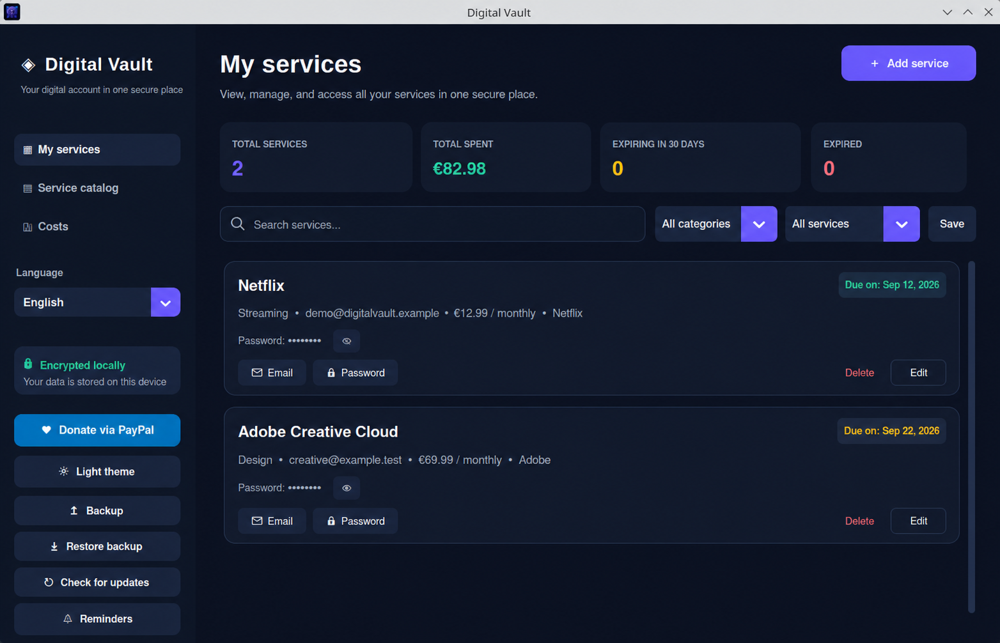

# Digital Vault

Digital Vault is a private, local-first desktop application for tracking subscriptions, online accounts, passwords, purchase links, receipts, warranties, and renewal reminders.



## Highlights

- Encrypted local vault protected by a master password.
- English user interface by default; Croatian is available from the app.
- Subscription costs, billing cycle, auto-renewal, and upcoming-payment reminders.
- IPTV records can store, open, and quickly copy a playlist or server URL.
- Purchase dates, expiry dates, seller warranties, receipts, notes, and seller contact links.
- Searchable service catalog, encrypted attachments, backups, restore, light/dark themes, and update checks.

## Run from source

```bash
python3 -m pip install -r requirements.txt
python3 app.py
```

On Linux, `./pokreni.sh` installs missing Python dependencies and starts the app. On Windows, use `pokreni.bat`.

Your vault data is stored only on your computer in `~/.digitalni_sef`. The master password is never stored or sent anywhere; if it is forgotten, encrypted data cannot be recovered.

## Downloads

Every release includes packages for:

- Windows: EXE
- Linux: AppImage, DEB, TAR.GZ, and Fedora RPM

Download the latest version from [GitHub Releases](https://github.com/danijel0304/digitalni-sef/releases).

## Privacy

Local vault records, settings, backups, and encrypted attachments are excluded from this repository through `.gitignore`.
